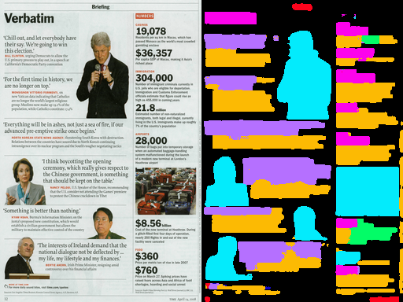
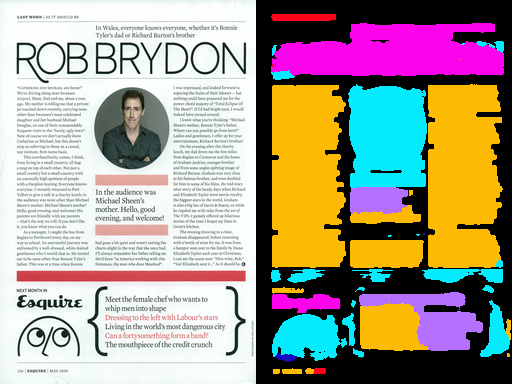
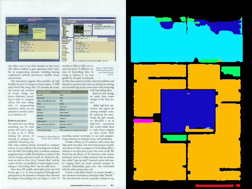
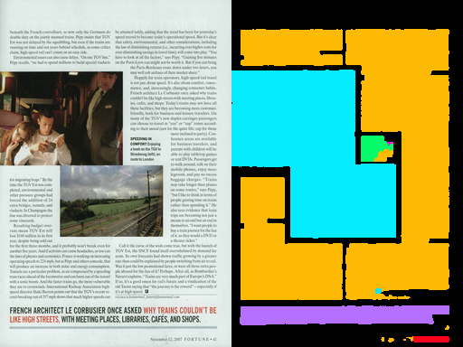
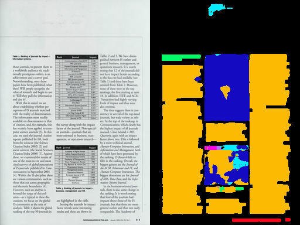
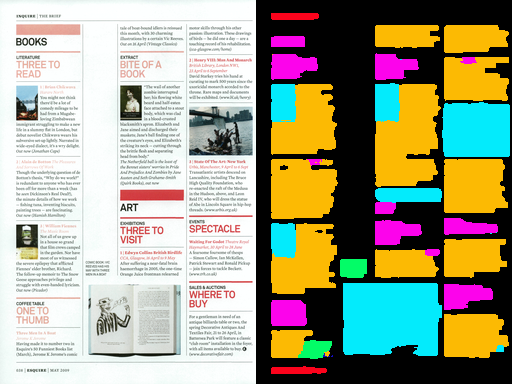
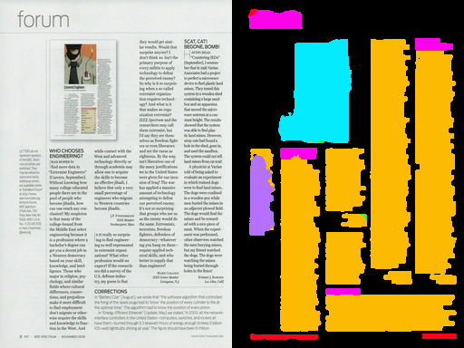

# Unet from based on and Inception like architecture

A network with traditional UNET replaced with Inception like blocks with dilations

Trained using 
- Generated images, which have 4 quarters from different images
- The 4 quarters have slight rotation
- All images have 2 channels which give the coordinates in x and y for image
- Augmentation with random flips, random brightness contrast, hue shifts and inversions

## Metrics
Mean IOUs  

Body Text | Heading | Floating Text | Caption | Header & Footer | Table | Graphic | Total
--------- | ------  | ------------- | ------- | --------------- | ----- | ------- | -----
93.68 | 62.681 | 55.079 | 69.939 | 90.558 | 73.350 | 68.598 | 74.215

## Results
-  a good increase of about 10 iou from previous train
- drop caps are now treated as part of text. earlier they used to be classified as image
- shadows are now not recognized as image
- better performance with non white pages

### Color
body text - yellow  
heading - pink  
floating - purple  
caption - green  
header&footer - red  
table - dark_blue  
graphic - light blue  

## Images

You can see all the validation set images in the Results folder

